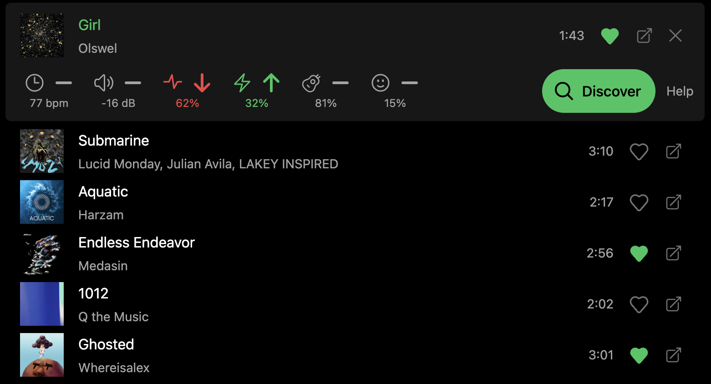

#  [Rabbit](https://rabbit.sspenst.com)

Discover new tracks using Spotify's audio features.

Select a track to listen to a short preview, then click discover to find similar tracks. Refine your search with audio features and save tracks you enjoy! Rabbit has been approved by the Spotify Developer Platform.

# 

## Local development

Copy `.env.example` to `.env` and provide the client ID and client secret from the Spotify Developer Dashboard. The secret is used only by Rabbit's server-side API routes for signed-out catalog access.

Open the development site at `http://127.0.0.1:3000` and add `http://127.0.0.1:3000/` as a Spotify redirect URI. Spotify treats `localhost` and `127.0.0.1` as different origins.
